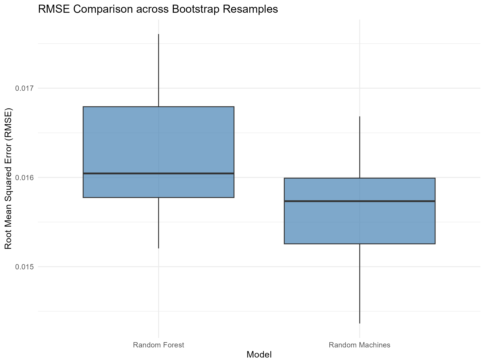
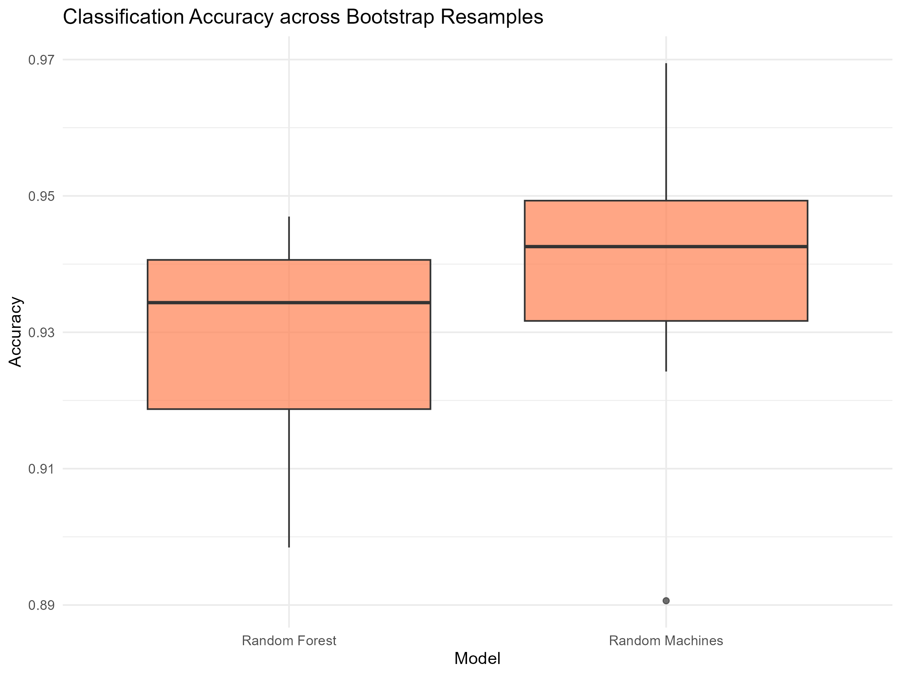

# Summary

*randomMachines* [@maia2025randomMachines] is an R package that implements a flexible ensemble
strategy for support vector machines (SVMs) [@cortes1995svm] in both classification and
regression settings. The method combines bagging with diversity induced
by multiple kernel functions (e.g., Gaussian, polynomial, Laplacian, and
linear), combining base learners to capture heterogeneous nonlinear
structures in the data. Individual models are trained on bootstrap
samples and aggregated with performance-based weights derived from
out-of-bag evaluation, yielding an ensemble with improved
robustness to the kernel selection and competitive predictive performance relative to common
baselines [@ara2021randommachines; @ara2022regressionrandommachines]. 

# Statement of need

The *randomMachines* package provides an implementation of the random machines method [@ara2021randommachines; @ara2022regressionrandommachines] an ensemble methodology,
employing Support Vector Machines (SVM) [@cortes1995svm] as base learners combined with
diverse kernel functions in a bagging structure. This software is
designed to address specific limitations in ensemble modeling,
particularly around flexibility and predictive power in both
classification and regression tasks.

Traditional ensemble techniques, such as Random Forests and standard
bagged SVMs, achieve higher predictive accuracy by combining multiple base
models. However, these methods face challenges: (1) Random Forests rely
exclusively on decision trees, limiting flexibility in scenarios where
complex non-linear kernel-based learners might perform better, and (2) standard
SVM-based ensembles often use a single kernel function across all base
learners, which can restrict the model's ability to capture complex
patterns within high-dimensional or nonlinear data. The *randomMachines*
package addresses these gaps by leveraging multiple kernel functions in
the ensemble, enhancing predictive accuracy
across diverse data contexts.

By integrating SVMs with a flexible choice of kernel functions—including
Gaussian, polynomial, Laplacian, and linear kernels—*randomMachines*
introduces a weighted, bagged model that adapts dynamically to data
characteristics. Its implementation builds upon recent research
advancements in ensemble support vector models, specifically those
demonstrating that diverse kernel ensembles can lead to significant
improvements in predictive performance
[@maia2021predictive; @ara2022regressionrandommachines]. This approach has shown strong performance indicating high predictive accuracy in domains where complex interactions and non-linear relationships are prevalent, such as bioinformatics, image classification, and
financial forecasting.

*randomMachines* emerges as an effective tool as an effective tool for researchers
and practitioners seeking enhanced flexibility and performance in
ensemble modeling, expanding the applicability of SVM-based techniques
across a range of scientific and applied disciplines.

Recently, Random Machines has been employed by several authors in both theoretical developments and applied studies [@gonccalves2023regression,@tikaria2025characterization, @yucost].

## Statistical background

Let $\{(\mathbf{x}_i, y_i)\}_{i=1}^{n}$ be a training dataset where $\mathbf{x}_i \in \mathbb{R}^p$ represents the 
input vector and $y_i$ is the target variable, which can be either categorical ($y_i \in \{-1,1\}$ 
for classification) or continuous ($y_i \in \mathbb{R}$ for regression). The *randomMachines* 
method follows a structured bagging-based approach, incorporating a probabilistic selection of kernel functions 
to increase model diversity and consequently the predictive performance.

Given a predefined set of $R$ kernel functions $\{K_r(\mathbf{x}, \mathbf{x}')\}_{r=1}^{R}$, individual models $h_r(\mathbf{x})$ 
are trained on a validation set. The probability of selecting each kernel is computed differently for 
classification and regression.

For classification, the model selection probability $\lambda_r$ is determined based on a performance measure $0 \le P \le 1$, when $P=0.5$ indicates a random prediction:

$$\lambda_r = \frac{\log\left(\frac{\text{P}_r}{1 - \text{P}_r}\right)}{\sum_{i=1}^{R} \log\left(\frac{\text{P}_i}{1 - \text{P}_i}\right)}$$

where $\text{P}_r$ represents the performance measure of model $h_r(\mathbf{x})$.

For regression, the probability of selecting each kernel is determined using a performance measure $Q \ge 0$, when $Q=0$ indicates a perfect prediction:

$$
\lambda_r = \frac{e^{-\beta \delta_r}}{\sum_{j=1}^{R} e^{-\beta \delta_j}}
$$

where $\delta_r$ is the standardized $P$ of each kernel-based model, and $\beta$ is a regularization 
parameter controlling the degree of penalization of kernels with higher error over the validation set.

For both classification and regression, $B$ bootstrap samples are drawn from the original training data. 
Each sample is used to train a support vector model $g_b(\mathbf{x})$ using a kernel selected randomly with 
probability $\lambda_r$. The models are assigned weights based on their out-of-bag (OOB) performance.

For classification, the model weight $w_b$ is given by:

$$
w_b = \frac{1}{(1 - \Omega_b)^2}, \quad b = 1, \dots, B
$$

where $\Omega_b$ is the classification error for model $g_b(\mathbf{x})$.

For regression, the weight $w_b$ is defined as:

$$
w_b = \frac{1}{\delta_b^2}, \quad b = 1, \dots, B
$$

where $\delta_b$ is the $P$ of the model $g_b(\mathbf{x})$.

The final ensemble predictions are computed as follows:

For classification is used a weighted majority vote:

$$
G(\mathbf{x}) = \text{sgn} \left( \sum_{b=1}^{B} w_b g_b(\mathbf{x}) \right)
$$

For the regression task is used weighted average:

$$
G(\mathbf{x}) = \sum_{b=1}^{B} w_b g_b(\mathbf{x})
$$

This methodology ensures that models with lower classification error (or lower $P$ in regression) 
contribute more significantly to the final ensemble decision while keeps the diversity from different kernel functions. 

# Examples

To illustrate the typical workflow and expected outputs of *randomMachines*,
we provide two reproducible experiments (one regression and one classification)
implemented in the script `execute_examples.R`. The script also writes the
numerical summaries to CSV files and saves the figures as PNG files in the
`results/` directory.

Both experiments follow the same evaluation framework. First, a dataset is
resampled using 10 bootstrap splits created with `rsample::bootstraps()`. For
each split, models are fitted using the bootstrap training set
(`rsample::analysis()`) and evaluated on the corresponding holdout set
(`rsample::assessment()`). Performance is summarized by the mean and standard
deviation across splits. We emphasize that these examples are designed as a
reproducible demonstration of usage, rather than an exhaustive benchmark. The absolute performance will vary with preprocessing, tuning budget, and data
subsampling choices.

## Regression task: Brazilian Social Programme data

For regression, we use a subset of 1000 observations from the `bolsafam` data
included in the package, where the response variable $y$ represents the
usage rate of the Brazilian Social Programme (Bolsa Família) across Brazilian municipalities. We
compare *randomMachines*, Random Forest [@breiman2001random], and a feed-forward neural network [@rumelhart1986learning]. *randomMachines* is trained with
$B = 25$ bootstrap samples and `cost = 1`; Random Forest
is trained with `ntree = 25`; and the neural network uses two hidden layers
(`hidden = c(5, 3)`) with linear output. Predictive performance is assessed with
root mean squared error (RMSE) on the holdout cross-validation setting.

Table 1 reports the average RMSE and its
variability across the 10 splits. Under this experimental setup,
*randomMachines* obtains a slightly lower mean RMSE than Random Forest, while
the neural network yields a substantially higher RMSE and larger variability. Figure 1 shows the comparison between Random Machines and Random Forest.

| Model            | RMSE (mean) | RMSE (sd) |
|:-----------------|------------:|----------:|
| Random Machines  | 0.01565     | 0.00070   |
| Random Forest    | 0.01623     | 0.00075   |
| Neural Network   | 0.03269     | 0.01019   |

Table: Table 1. Regression results (mean and standard deviation of RMSE across 10
bootstrap holdout resamples). 

<figure id="fig:rmse-bolsafam">
  
 

  <figcaption>
    Figure 1. RMSE distribution across bootstrap holdout resamples for the Bolsa Família
regression task. For readability, the figure shows *randomMachines* and Random
Forest; the neural network results are reported in Table 1.
  </figcaption>
</figure>

## Classification task: Ionosphere radar data

For classification, we evaluate *randomMachines* on the `ionosphere` dataset, a
binary classification benchmark with a nonlinear decision boundary. We compare
*randomMachines* and Random Forest across the same 10 bootstrap splits,
using accuracy on the out-of-bag set as the performance metric. The configuration uses $B = 50$ base learners with `cost = 1` and
`prob_model = FALSE` for *randomMachines*, and `ntree = 50` for Random Forest.

Table 2 summarizes the mean and standard
deviation of the accuracy values across splits. In this run, *randomMachines* attains a
slightly higher mean accuracy than Random Forest, with comparable variability. Figure 2 shows the comparison between Random Machines and Random Forest.

| Model           | Accuracy (mean) | Accuracy (sd) |
|:----------------|----------------:|--------------:|
| Random Machines | 0.93813         | 0.02095       |
| Random Forest   | 0.92818         | 0.01738       |

Table: Table 2. Classification results (mean and standard deviation of accuracy across
10 bootstrap holdout resamples).

<figure id="fig:acc-ionosphere">
  
 

  <figcaption>
    Figure 2. Classification accuracy across bootstrap holdout resamples for the ionosphere
    task comparing <em>randomMachines</em> and Random Forest.
  </figcaption>
</figure>

# AI usage disclosure

Generative AI was used in a limited way during the preparation of this
submission for copy-editing and improving the clarity, grammar, and
overall readability of the paper text. The assistance was
provided through the GPT-5.4 model.

All AI-assisted text was reviewed, edited, and validated by the human
authors, who remain fully responsible for the accuracy, originality,
licensing, and ethical and legal compliance of the submitted materials.
The authors made all core research, software, and writing decisions.

# References
